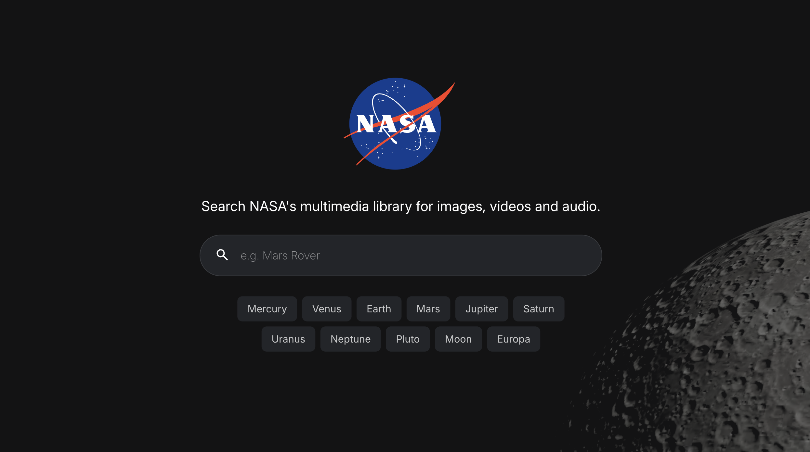

# NASA Media Explorer

A React-based application that allows users to explore NASA's multimedia library.



---

## Features

- Search NASA's media library for images, videos and audio
- Filter by media type and browse paginated results
- Watch videos and play audio in the browser
- Download original files
- Shareable search params
- Interactive 3D moon background using WebGL

---

## Technologies Used

- Vite
- TypeScript
- React
- TanStack Router (file-based routing)
- TanStack Query (data fetching & caching)
- Zod (schema validation)
- Vitest (browser testing)
- MSW (API mocking)
- Three.js / React Three Fiber

---

## Browser Support

The application uses modern web features and supports:

- Chrome (latest)
- Firefox (latest)
- Safari (latest)
- Edge (latest)

---

## Getting Started

### Installation

```bash
npm install
```

Note: This application uses NASA's public images API, which **does not require an API key**.

### Scripts

`npm run dev` — Start dev server
`npm run build` — Build for production
`npm run preview` — Preview production build locally
`npm test` — Run tests (headless)
`npm run test:ui` — Open Vitest UI
`npm run test:coverage` — Generate coverage report

---

## Sponsor

If you find this project useful, consider sponsoring me or making a one-time donation so I can do more like this in the future.

[Sponsor](https://github.com/sponsors/Steveeeie)
