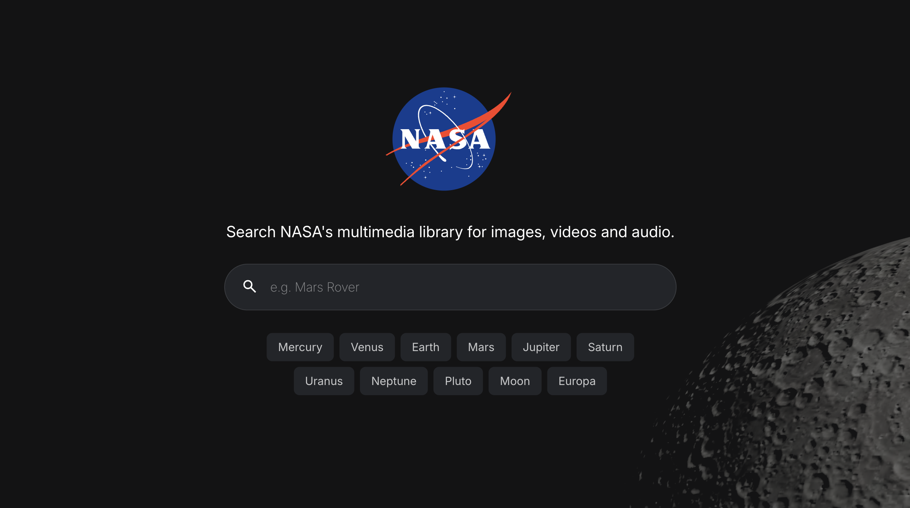

# NASA Media Explorer

A React-based application that allows users to explore NASA's multimedia library.

[View Demo](https://www.stevemeredith.com/nasa-media-explorer/)

---



---

## Features

- Search NASA's media library for images, videos and audio
- Filter by media type and browse paginated results
- Watch videos and play audio in the browser
- Download original files
- Shareable search params
- Interactive 3D moon background using WebGL

---

## Technologies Used

- Vite
- TypeScript
- React
- TanStack Router (file-based routing)
- TanStack Query (data fetching & caching)
- Zod (schema validation)
- Vitest (browser testing)
- MSW (API mocking)
- Three.js / React Three Fiber

---

## Browser Support

The application uses modern web features and supports:

- Chrome (latest)
- Firefox (latest)
- Safari (latest)
- Edge (latest)

---

## Getting Started

### Installation

```bash
pnpm install
```

Note: This application uses NASA's public images API, which **does not require an API key**.

### Scripts

- `pnpm dev` - Start dev server
- `pnpm build` - Build for production
- `pnpm preview` - Preview production build locally
- `pnpm test` - Run tests (headless)
- `pnpm test:ui` - Open Vitest UI
- `pnpm test:coverage` - Generate coverage report
